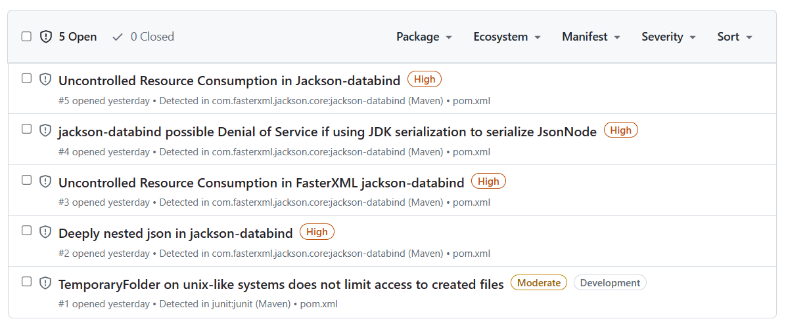
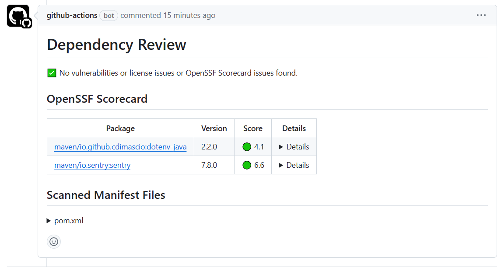
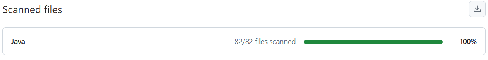
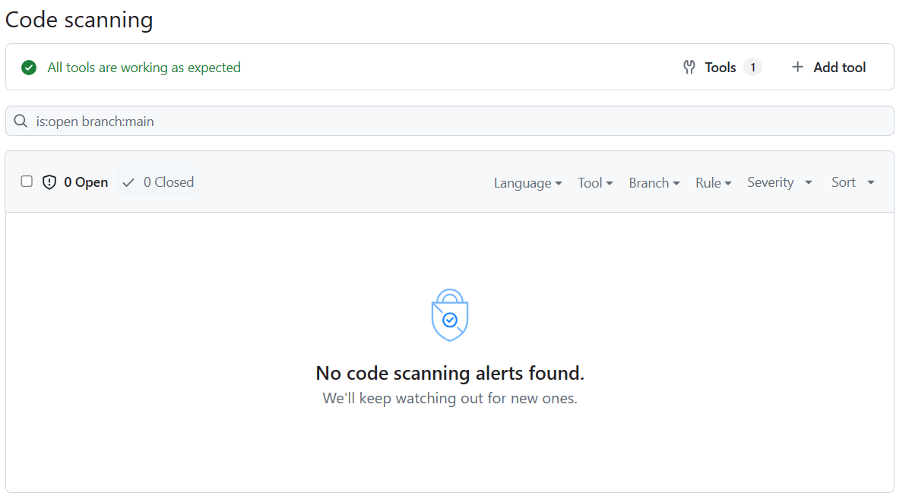
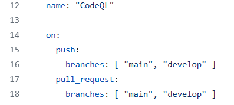
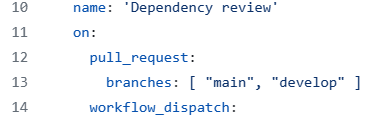

### Processus

1) Un des problèmes rencontrés à été de prendre en compte la date de remise du projet pour faire notre projet, en effet, on se prennait pas mal à la dernière minute, ce qui nous donnais pas beaucoup de temps pour tout implémenter. Une des solutions qu'on pourrait adopter pour régler ce problème est de se donner un plan/horaire que tout le monde doit respecter pour pouvoir mettre le temps qu'il faut sur le projet. Par contre, puisqu'on est à l'université, on n'a pas que ça à faire, donc c'est plus dur de s'adapter à cela.

Un autre problème a été l'écriture des tests unitaires, en effet, souvent, nous écrivions nos fonctions et nos classes sans écrire les tests directements après, ce qui mennait parfois au autre membre de l'équipe à écrire des tests unitaires pour des parties de code qu'ils n'ont pas écrit, ce qui rendait le tout plus complexe et long à faire. Une des solutions serait que chacun écrive les tests directement après l'implémentation de chacune de leurs fonctions écrites.

2) Lors de l'intégration de nouvelles technologies, nous avons pris le temps d'en apprendre plus sur celles-ci. En effet, nous sommes d'avis qu'il est plus facile et souhaitable d’en apprendre plus sur un outil ou une librairie avant de l’ajouter à notre solution. Pour se faire, l’équipe testait certaines fonctionnalités des technologies dans un projet « test » à part. L’ensemble des tests se sont fait à la main : cela nous a permis d’accélérer le processus et de réduire la quantité de fichier dans le projet. Les étapes du processus sont bien simples : d’abord, nous faisions une recherche sur la technologie en question; ensuite, nous testions celle-ci dans un projet détaché de notre logiciel; nous intégrions la technologie au projet; finalement, nous effectuions des tests manuels sur les nouvelles fonctionnalités ajoutées.

À la suite de cette démarche, l’équipe a appris l’importance de la recherche et des tests. En effet, ces étapes, qui semblent être superflu à l’œil du développeur inexpérimenté, permettent de prévenir des erreurs, d’accélérer le développement du projet, d’augmenter la duré de vie du logiciel et d’assurer une bonne qualité du code. De plus, la communication du savoir dans l’équipe a joué un rôle crucial dans l’ajout des technologies : chaque membre de l’équipe possède son propre bagage de connaissances qui a permis de sauver plusieurs heures de recherche et de test aux autres membres.

3) Un des bons coups de notre équipes est l'architecture du projet. Un autre serait la nomenclature des éléments, que ce soit les classes, fonctions ou variables. Un dernier serait notre collaboration, communication, travaille d'équipe en général.

4) Ne pas hésiter à poser des questions, que ce soit à ton équipe, ou aux aidants du cours, ils sont là pour t'aider à ta réussite.

5) Un des trucs est la nomenclature de tous les éléments, cela devient utile, car ça enlève le besoin de mettre des commentaires partout dans notre code pour pouvoir comprendre ce qui se passe. Un autre truc serait d'utiliser ChatGPT pour nous aider lorsque nécessaire, car c'est un excellent outil si on sait s'en servir.

# Sécurité Logicielle
## Analyse des dépendances
### Dependabot
Dependabot est un outil intégré dans GitHub qui permet d'analyser les dépendances vulnérables automatiquement.
Voici les résultats obtenus lors de l'analyse :
<br />

<br />
L'ensemble des vulnérabilités trouvées sont dans le pom.xml.

Voici les CVE recueillis par dependabot :
```
CVE-2022-42003
CVE-2021-46877
CVE-2022-42004
CVE-2020-36518
CVE-2020-15250
```
---
### Dependency Review
Afin d'avoir une autre perspective sur les vulnérabilités de dépendance, nous avons utilisé
un autre outil : dependancy-review. Cet outil est configuré de manière à ce qu'il s'exécute lors
automatiquement d'un push et manuellement par un développeur.
<br />

<br />
Tel qu'on peut voir, l'outil a trouvé deux failles de dépendances lors d'un pull request.
---
### Analyse du code
D'un autre côté, nous avons analysé le code afin d'y trouvé de potentielles failles
de sécurité. Pour se faire, nous avons utilisé CodeQL, un outil disponible sur GitHub,
et nous l'avons intégré à notre Workflow. Lors d'un push dans main, cet outil est lancé automatiquement
et fait un balayage de vulnérabilités sur notre branch main. À des fins de tests, nous l'avons
lancé manuellement. Voici les résultats :
<br />


<br />
Tel qu'on peut le remarqué, tous nos fichiers ont été analysés et aucune vulnérabilité
n'a été trouvé.

Voici la configuration pour le lancement automatique des analyses de CodeQL et de
dependency-review :
<br />



---
## Pratiques sécuritaires
Afin d'améliorer l'aspect sécurité de notre logiciel, nous pourrions adopter une approche
DevSecOps. En effet, cette approche encourage la collaboration entre les membres des équipes de
développement, de sécurité et d'opération et prône l'automatisation. La force du DevSecOps est
la rapidité de la détection et de la correction des vulnérabilités. Cela a pour effet de réduire
les coûts de correction, d'améliorer la qualité logiciel et finalement, de livrer le produit plus
rapidement.

Une autre pratique cruciale à la sécurité de notre projet serait celle de la gestion des vulnérabilités.
En effet, celle-ci cherche à classer les vulnérabilités et à garder un suivi de celles-ci.
Une gestion des vulnérabilités est importante lorsqu'un projet devient gros et que de multiples
vulnérabilités sont découvertes. Cette gestion permet de savoir quelle faille priorisé et comment la régler.

D'un autre côté, nous pourrions effectué plus de test. En effet, nous pourrions utiliser des solutions de
test statique du code (CodeQL), utiliser des outils qui test dynamiquement les appels API de notre application et/ou
faire appel à un pentester pour tester notre projet. Cela permettrait de couvrir tous les angles de notre projet
et ainsi être sûr d'avoir trouvé le maximum de vulnérabilités exposées.
