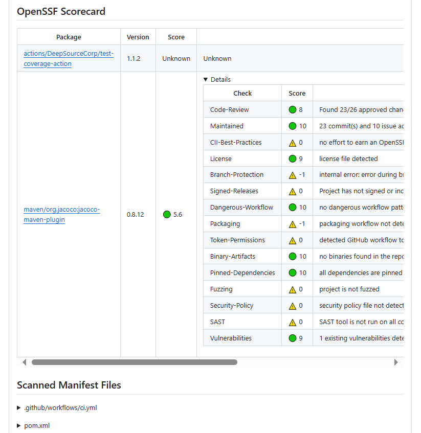
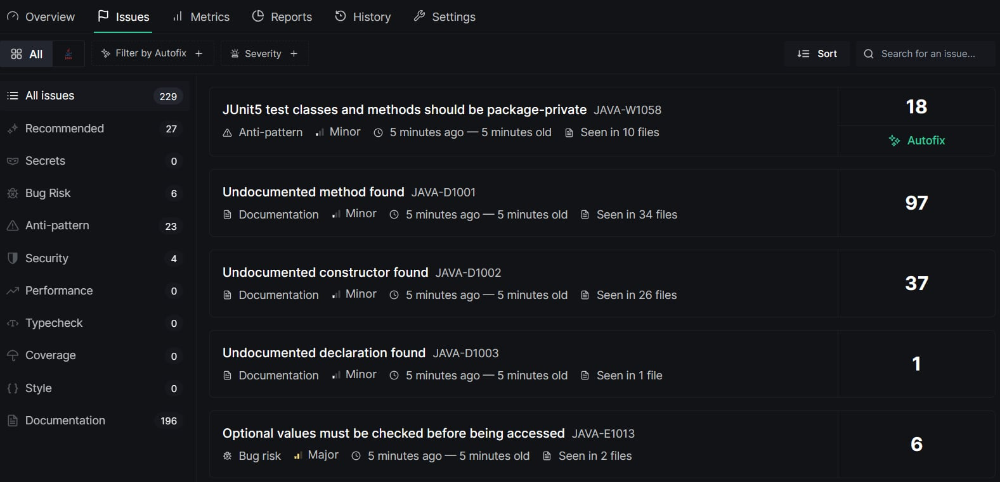
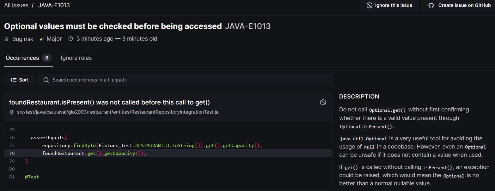
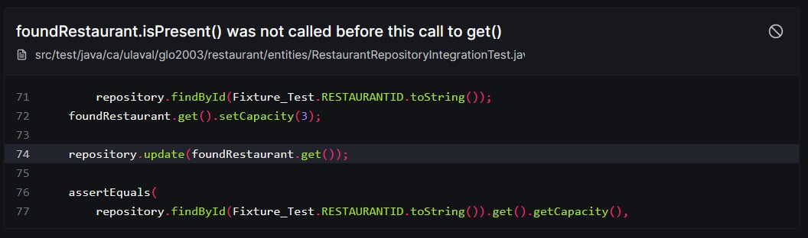
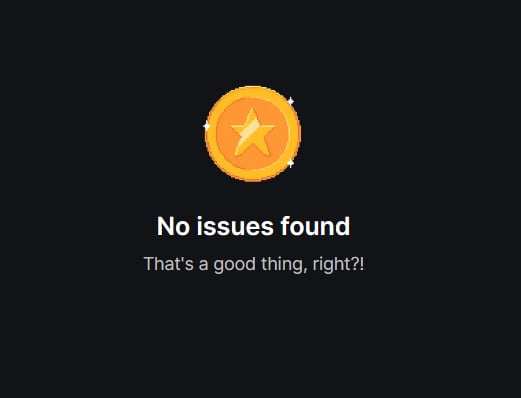

## Processus
### Questions

---
1) Un des problèmes rencontrés à été de prendre en compte la date de remise du projet pour faire notre projet, en effet, on se prennait pas mal à la dernière minute, ce qui nous donnais pas beaucoup de temps pour tout implémenter. Une des solutions qu'on pourrait adopter pour régler ce problème est de se donner un plan/horaire que tout le monde doit respecter pour pouvoir mettre le temps qu'il faut sur le projet. Par contre, puisqu'on est à l'université, on n'a pas que ça à faire, donc c'est plus dur de s'adapter à cela.
Un autre problème a été l'écriture des tests unitaires, en effet, souvent, nous écrivions nos fonctions et nos classes sans écrire les tests directements après, ce qui mennait parfois au autre membre de l'équipe à écrire des tests unitaires pour des parties de code qu'ils n'ont pas écrit, ce qui rendait le tout plus complexe et long à faire. Une des solutions serait que chacun écrive les tests directement après l'implémentation de chacune de leurs fonctions écrites.

2) Lors de l'intégration de nouvelles technologies, nous avons pris le temps d'en apprendre plus sur celles-ci. En effet, nous sommes d'avis qu'il est plus facile et souhaitable d’en apprendre plus sur un outil ou une librairie avant de l’ajouter à notre solution. Pour se faire, l’équipe testait certaines fonctionnalités des technologies dans un projet « test » à part. L’ensemble des tests se sont fait à la main : cela nous a permis d’accélérer le processus et de réduire la quantité de fichier dans le projet. Les étapes du processus sont bien simples : d’abord, nous faisions une recherche sur la technologie en question; ensuite, nous testions celle-ci dans un projet détaché de notre logiciel; nous intégrions la technologie au projet; finalement, nous effectuions des tests manuels sur les nouvelles fonctionnalités ajoutées.
À la suite de cette démarche, l’équipe a appris l’importance de la recherche et des tests. En effet, ces étapes, qui semblent être superflu à l’œil du développeur inexpérimenté, permettent de prévenir des erreurs, d’accélérer le développement du projet, d’augmenter la duré de vie du logiciel et d’assurer une bonne qualité du code. De plus, la communication du savoir dans l’équipe a joué un rôle crucial dans l’ajout des technologies : chaque membre de l’équipe possède son propre bagage de connaissances qui a permis de sauver plusieurs heures de recherche et de test aux autres membres.

3) Un des bons coups de notre équipes est l'architecture du projet. Un autre serait la nomenclature des éléments, que ce soit les classes, fonctions ou variables. Un dernier serait notre collaboration, communication, travaille d'équipe en général.

4) Ne pas hésiter à poser des questions, que ce soit à ton équipe, ou aux aidants du cours, ils sont là pour t'aider à ta réussite.

5) Un des trucs est la nomenclature de tous les éléments, cela devient utile, car ça enlève le besoin de mettre des commentaires partout dans notre code pour pouvoir comprendre ce qui se passe. Un autre truc serait d'utiliser ChatGPT pour nous aider lorsque nécessaire, car c'est un excellent outil si on sait s'en servir.

---

# Spécifications de Rate

---
## Create Rate

---
**Path**

`POST /restaurants/<id>/rates`

**Headers**

- `Customer: string`: le nom du consommateur

**Body**

```ts
{
  rating: number, // le rating
  comment: string, // le commentaire (optionnel)
  visiteDate: string, // la date de visite
}
```

<details>
<summary>Exemple</summary>

```json
{
  "rating": 4,
  "comment": "Bonne nourriture!",
  "visiteDate": "2024-04-25"
}
```
</details>

### Réponses

- `201 CREATED`: succès

  **Headers**

   - `Location: string`: URI du rate créé
      - format: `<host>/rate/<id>`
      - Exemple: `http://localhost:8080/rate/123`


- `400 BAD REQUEST`: un des paramètres obligatoires est manquant

  **Body**

  ```ts
  {
    error: "MISSING_PARAMETER",
    description: string
  }
  ```


- `400 BAD REQUEST`: un des paramètres n'est pas valide

  **Body**

  ```ts
  {
    error: "INVALID_PARAMETER",
    description: string
  }

- `404 NOT FOUND`: le restaurant n'existe pas
- `404 NOT FOUND`: la réservation n'existe pas


## Get Rate

---
**Path**

`GET /restaurants/<id>/rates`

### Réponses

- `200 OK`: succès

  **Body**
    ```ts
    {
     rating: number,
     comment: string,
     visitDate: string 
    }
  ```

<details>
<summary>Exemple</summary>

```json
[
  {
    "rating": 2,
    "comment": "Un peu boff!",
    "visiteDate": "2023-02-22"
  },
]
```
</details>

- `404 NOT FOUND`: le restaurant n'existe pas

---
# Sécurité Logicielle
## Analyse des dépendances
### Dependabot
Dependabot est un outil intégré dans GitHub qui permet d'analyser les dépendances vulnérables automatiquement.
Voici les résultats obtenus lors de l'analyse :
<br />

<br />
L'ensemble des vulnérabilités trouvées sont dans le pom.xml.

Voici les CVE recueillis par dependabot :
```
CVE-2022-42003
CVE-2021-46877
CVE-2022-42004
CVE-2020-36518
CVE-2020-15250
```
---
### Dependency Review
Afin d'avoir une autre perspective sur les vulnérabilités de dépendance, nous avons utilisé
un autre outil : dependancy-review. Cet outil est configuré de manière à ce qu'il s'exécute lors
automatiquement d'un push et manuellement par un développeur.
<br />


<br />
Tel qu'on peut voir, l'outil a trouvé deux failles de dépendances lors du premier pull request et deux autres vulnérabilités lors du deuxième pull request.

---
### Analyse du code
D'un autre côté, nous avons analysé le code afin d'y trouvé de potentielles failles
de sécurité. Pour se faire, nous avons utilisé CodeQL, un outil disponible sur GitHub,
et nous l'avons intégré à notre Workflow. Lors d'un push dans main, cet outil est lancé automatiquement
et fait un balayage de vulnérabilités sur notre branch main. À des fins de tests, nous l'avons
lancé manuellement. Voici les résultats :
<br />


<br />
Tel qu'on peut le remarqué, tous nos fichiers ont été analysés et aucune vulnérabilité
n'a été trouvé.

Voici la configuration pour le lancement automatique des analyses de CodeQL et de
dependency-review :
<br />


---
## Pratiques sécuritaires
Afin d'améliorer l'aspect sécurité de notre logiciel, nous pourrions adopter une approche
DevSecOps. En effet, cette approche encourage la collaboration entre les membres des équipes de
développement, de sécurité et d'opération et prône l'automatisation. La force du DevSecOps est
la rapidité de la détection et de la correction des vulnérabilités. Cela a pour effet de réduire
les coûts de correction, d'améliorer la qualité logiciel et finalement, de livrer le produit plus
rapidement.

Une autre pratique cruciale à la sécurité de notre projet serait celle de la gestion des vulnérabilités.
En effet, celle-ci cherche à classer les vulnérabilités et à garder un suivi de celles-ci.
Une gestion des vulnérabilités est importante lorsqu'un projet devient gros et que de multiples
vulnérabilités sont découvertes. Cette gestion permet de savoir quelle faille priorisé et comment la régler.

D'un autre côté, nous pourrions effectué plus de test. En effet, nous pourrions utiliser des solutions de
test statique du code (CodeQL), utiliser des outils qui test dynamiquement les appels API de notre application et/ou
faire appel à un pentester pour tester notre projet. Cela permettrait de couvrir tous les angles de notre projet
et ainsi être sûr d'avoir trouvé le maximum de vulnérabilités exposées.

## Open Sourcing

### Questions
1. **Nommez 3 avantages à contribuer à des projets open source en tant qu'entreprise et justifiez en quoi cela peut
   être bénéfique pour tous.**

   En contribuant à des projets open source, une entreprise peut bénéficier de plusieurs avantages.
   Tout d'abord, cela peut augmenter sa visibilité et améliorer sa réputation dans le domaine technologique.
   En participant à des projets de différentes tailles, l'entreprise devient plus connue et suscite l'intérêt
   de personnes du domaine, ce qui peut attirer de futurs employés ou clients.

   Ensuite, en contribuant à plusieurs projets, les développeurs de l'entreprise sont exposés à différentes méthodes et
   approches de développement logiciel, ce qui constitue une excellente opportunité d'apprentissage et d'amélioration des compétences.
   Cette exposition indirecte peut également contribuer à l'amélioration des compétences des développeurs pour les projets internes de l'entreprise à l'avenir.

   Enfin, un troisième avantage est la réduction des coûts et l'accélération du développement. En utilisant et en contribuant à
   des projets open source, l'entreprise devient moins dépendante de solutions propriétaires coûteuses et moins flexibles.
   De plus, en utilisant des projets open source, il est possible de personnaliser et d'ajuster des fonctionnalités pour répondre aux besoins
   spécifiques de l'entreprise, ce qui peut accélérer le développement tout en préservant la qualité du produit.

   En résumé, en contribuant au développement de projets open source, une entreprise peut améliorer sa visibilité et sa crédibilité,
   renforcer ses compétences et accélérer son développement logiciel, le tout sans compromettre la qualité de ses produits.
   
2. **Décrivez 3 défis qu'impose la mise en place d'un projet open source et justifiez.**

   Un des principaux défis dans la gestion des projets open source est la gestion des contributions et de la communauté.
   Avec un grand nombre de personnes pouvant contribuer au projet et une variété de compétences techniques, il peut être
   difficile de gérer les contributions, les questions et les conflits tout en maintenant un environnement accueillant pour tous.
   Un autre défi majeur est de maintenir la qualité et la sécurité du code. Comme mentionné précédemment, les compétences variées
   de chaque contributeur peuvent entraîner la présence de code défectueux ou de mauvaise qualité, ce qui nécessite des efforts pour
   garantir un produit final de qualité. Enfin, assurer un fonctionnement à long terme peut être difficile, car le progrès du projet est
   souvent influencé par le nombre de contributions. Si les contributions diminuent avec le temps, il peut être nécessaire de mettre en place
    des méthodes alternatives pour garantir l'avancement du projet tout en étant moins dépendant des contributions. Cependant, trouver les fonds
    pour ces alternatives peut être difficile, car les projets open source ne génèrent généralement pas de revenus.
   
3. **Quelle information vous a-t-elle le plus surprise à propos de l'open source?**
   
   L'information qui nous a le plus surpris est que l'open source ne se limite pas au développement logiciel.
   Habituellement, lorsque nous entendons le terme "open source", nous pensons immédiatement à des projets tels que
   Linux, VSCode, Firefox et TensorFlow. C'est pourquoi découvrir que des livres ou même une liste de faits amusants
   sur les macareux peuvent être des projets open source nous a vraiment surpris.

4. **Pourquoi utiliser la license GNU**
   
   La première raison est que cette licence exige que les changements apportés soient indiqués, facilitant ainsi
   l'utilisation de la version modifiée du code car les nouveaux comportements de l'application sont clairement indiqués.
   Ensuite, nous avons choisi cette licence car elle oblige les personnes qui modifient le projet à utiliser la même licence
   pour leurs modifications. Cet aspect de la licence GNU est important pour nous car nous voulons que toutes les modifications 
   apportées au code soient soumises aux mêmes conditions à l'avenir. Enfin, nous souhaitons également que toutes les
   modifications apportées au code demeurent open source. La licence GNU est parfaite pour garantir cela car elle exige que les modifications soient publiées.

## Outils d'analyses de code (SCA)

Intégrez un ou plusieurs outils d'analyse de code vous permettant d'évaluer :

1. **La *qualité* du code (clean code, bogues potentiels, optimisations, meilleures pratiques, etc.)**
   Pour la qualité du code, nous avons utilisé DeepSource.
   Voici l'analyse globale :
   <br />
   
   <br />
   Nous pouvons voir que DeepSource a détecté des problèmes dans notre projet, plus spécifiquement :
   <br />
   
   
   <br />
   Pour le style du code (CLEN CODE): DeepSource n'a rien détecté, l'utilsation de Maven spotless nous permet d'avoir aucune erreur dans le style du code.
   <br />
   
   <br />
2. **La couverture des tests**
   
3. **La sécurité du code (voir Sécurité logicielle plus haut dans le fichier)**
   
